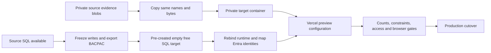

# Azure migration with data — operator runbook

Version: 2026-10-06. Applies to this repository on `main`, SQL migrations 001–051, Vercel Services (`api` + `web`), Microsoft Entra sign-in and private Blob evidence. This is a preparation/runbook document, **not evidence that a new environment or a data migration has been completed**. Follow [the handover](HANDOVER.md) and [the approved access baseline](ACCESS_MODEL_REDESIGN.md).

## 1. Choose the path before creating anything

| Path                                        | What it preserves                                                                                        | Prerequisite                                                                        |
| ------------------------------------------- | -------------------------------------------------------------------------------------------------------- | ----------------------------------------------------------------------------------- |
| Full migration                              | SQL schema and all exported table data, IDs, claims, history, learning, requests, access and Blob images | Readable source SQL or an existing verified full BACPAC; private source Blob access |
| Fresh start                                 | Repository schema and explicitly selected seed/provisioning data                                         | Accept that existing records are **not** recovered                                  |
| Existing tenant, new eligible free database | Avoids changing employee Entra identities; still needs runtime binding verification                      | Offer eligibility and a complete export for data preservation                       |
| New Azure account/subscription/tenant       | New infrastructure and credentials; existing business IDs can be retained                                | Offer eligibility, source export and an approved person-to-new-object-ID mapping    |

**Current blocker:** source SQL is paused after exhausting October compute. Its error says renewal is **1 November 2026, 00:00 UTC / 05:30 IST**. Creating a new identity/database cannot read the paused source. No confirmed full SQL export is currently recorded. Without a previously verified export, a no-paid full migration must wait for source availability. Git, seed JSON, screenshots and the KT schema are not backups of live records. Blob files can be copied independently while storage is accessible, but they do not reconstruct SQL metadata.

The SQL offer currently includes 100,000 vCore-seconds, 32 GB data and 32 GB backup per eligible database/month, with up to ten databases per subscription. A new Microsoft ID is therefore not inherently necessary. Eligibility is checked by Microsoft; this guide does not promise another free subscription or unlimited compute. Use accurate account details and the offered signup flow. See [free offer FAQ](https://learn.microsoft.com/en-us/azure/azure-sql/database/free-offer-faq?view=azuresql).

Azure does not support restoring/converting an existing database directly into its free offer. The logical transfer path below **pre-creates an eligible empty free target**, then uses SqlPackage against that target. Import into an existing empty SQL database is documented, but this exact cross-tenant/free-target combination still requires a rehearsal; it has not been executed here. Do not use a portal restore/import wizard that silently creates a paid database. See [offer restrictions](https://learn.microsoft.com/en-us/azure/azure-sql/database/free-offer?view=azuresql) and [BACPAC import](https://learn.microsoft.com/en-us/azure/azure-sql/database/database-import?view=azuresql).

## 2. What must move



- SQL: **all user tables**, including `SchemaMigration`, account/people/access, organization/reporting, versioned catalogue, claims/evidence metadata, review history, learning/practice/logs, recommendations, requests/events, conversations and audit/budget records. Preserve business UUIDs, application revisions, dates and JSON payloads. Do not select only the tables shown in a screenshot.
- Blob: evidence object bytes, full names/prefixes, content type and metadata. SQL `SkillClaimEvidence` references those names. SQL export does not include object bytes.
- Recreate separately: SQL server settings/firewall/Entra administrator, new runtime service principal and secret, SPA/API registrations/consent, storage settings/credentials, Vercel environment and model configuration.
- Do not migrate browser localStorage, MSAL tokens, demo cookies or live connections. SQL physical principal IDs and `rowversion` values are not portable application identity/revision contracts. Clients must reload after cutover.

## 3. Record a migration worksheet privately

Record these outside Git in a restricted operator folder. Never place real employee rows, exports, SAS URLs or secrets in the documentation.

| Item                                                      | Source                                       | Target                                      |
| --------------------------------------------------------- | -------------------------------------------- | ------------------------------------------- |
| Tenant and subscription IDs                               | Existing IDs                                 | Verified target IDs                         |
| SQL server / database / collation                         | Source names and collation                   | Target names; same collation                |
| Application `ACCESS_ACCOUNT_ID`                           | Existing workspace UUID                      | **Same UUID for a full migration**          |
| SPA / API application IDs                                 | Current registration IDs                     | Retained in same tenant or newly registered |
| Runtime application ID / enterprise-application object ID | Existing identity                            | New restricted runtime identity             |
| Blob account / container                                  | Existing private storage                     | New private account; preserve blob paths    |
| Deployment                                                | Current exact commit + environment version   | Preview and final production deployment IDs |
| Backup                                                    | Export UTC time, SHA-256, row-count manifest | Import time and verification result         |

All `<PLACEHOLDERS>` in commands are intentionally incomplete; replace locally. Do not paste source secrets into a new tenant's environment accidentally.

## 4. Create/select the Azure identity and subscription

1. If choosing a new identity, create your Microsoft account yourself, configure recovery/MFA and sign in to [Azure](https://portal.azure.com). Complete signup/payment-verification/terms yourself; confirm eligibility and subscription type shown by Azure.
2. In Portal → **Directories + subscriptions**, select the intended directory and subscription. Record both IDs. An email address and a tenant are different concepts.
3. If staying in the existing tenant, select the existing subscription and inspect whether another free-offer database is available. Do not switch tenant merely to create a resource.
4. Create a dedicated resource group and choose the intended region. Review resource costs; free SQL does not make Blob storage, egress, AI or all other services free.
5. Sign the terminal into the same destination explicitly. Portal login does not authenticate Node setup tools.

```powershell
az login --tenant '<TARGET-TENANT-ID>'
az account set --subscription '<TARGET-SUBSCRIPTION-ID>'
az account show --query '{subscription:id,tenant:tenantId,name:name}' -o json
```

Keep source and target worksheet entries separate when changing CLI context.

## 5. Prepare tools and source code

Install Node 24, Python 3, Azure CLI, current Microsoft SqlPackage, Microsoft Storage Explorer (or AzCopy) from official sources. Use interactive MFA, not a password/token pasted into shell command history. SqlPackage's universal authentication examples support MFA; see [SqlPackage export](https://learn.microsoft.com/en-us/sql/tools/sqlpackage/sqlpackage-export?view=sql-server-ver17).

```powershell
Set-Location 'S:\Skill-Management-App'
git switch main
git pull --ff-only
git status --short
npm ci
npm run docs:check
npm run architecture:check
npm run typecheck
npm test
npm run build
sqlpackage /Version
```

Do not reset a dirty worktree. Pin and record the commit you will migrate. Store exports in an encrypted/restricted directory **outside this checkout**, for example `C:\MigrationBackups\SkillManagement`; create it before export. Restrict its permissions and retain a second protected copy. A BACPAC is not encrypted by the command below.

## 6. Export the source — full migration only

**STOP here if source SQL is still quota-paused and no verified export exists.** Do not label an empty/seeded target a full migration.

1. Plan a maintenance window and stop **all** source writers: hosted/local API instances, seed/import jobs and other clients. Merely closing one browser or disabling demo login does not freeze writes. Put the application in maintenance/offline mode using deployment control before exporting; this repo has no implemented maintenance toggle to assume exists.
2. Keep operator read access available. Record source versions, table counts, runtime grants and current identity mappings privately. Capture Blob count/bytes/name manifest during the same write freeze.
3. Connect as the **source setup/Entra administrator**, not the restricted API principal. Confirm `DB_NAME()` and server name before export.
4. Run a complete export (no `TableData` subset and no `VerifyExtraction=False`). Limit parallelism for the small free source. Exports consume compute too.

```powershell
$sourceConnection = 'Server=tcp:<SOURCE-SERVER>.database.windows.net,1433;Initial Catalog=<SOURCE-DATABASE>;Encrypt=True;TrustServerCertificate=False;Connection Timeout=30;'
$backupPath = 'C:\MigrationBackups\SkillManagement\full-source.bacpac'
sqlpackage /Action:Export /UniversalAuthentication:True `
  '/TenantId:<SOURCE-TENANT-ID>' "/SourceConnectionString:$sourceConnection" `
  "/TargetFile:$backupPath" /OverwriteFiles:False /MaxParallelism:2
if ($LASTEXITCODE -ne 0) { throw 'Export failed. Do not continue.' }
Get-FileHash -LiteralPath $backupPath -Algorithm SHA256
```

Keep writes stopped through cutover or perform a new final export/import after rehearsal. BACPAC is a logical snapshot, not change-data replication; writes after export are not automatically carried forward. [Export consistency requirement](https://learn.microsoft.com/en-us/azure/azure-sql/database/database-export?view=azuresql).

Run this read-only count manifest on source and target with the same pinned schema. Save results privately; expect all user tables, not just selected business examples.

```sql
SELECT DB_NAME() AS database_name, @@SERVERNAME AS server_name;
SELECT version FROM dbo.SchemaMigration ORDER BY version;
DECLARE @counts nvarchar(max);
SELECT @counts=STRING_AGG(CONVERT(nvarchar(max),
 N'SELECT N'''+REPLACE(s.name+N'.'+t.name,N'''',N'''''')+
 N''' AS table_name, COUNT_BIG(*) AS row_count FROM '+QUOTENAME(s.name)+N'.'+QUOTENAME(t.name)),N' UNION ALL ')
FROM sys.tables t JOIN sys.schemas s ON s.schema_id=t.schema_id
WHERE t.is_ms_shipped=0;
IF @counts IS NOT NULL EXEC sys.sp_executesql @counts;
```

Counts are necessary, not sufficient: also verify IDs, selected content/timestamps, relationships, constraints and evidence byte hashes. Treat physical runtime binding differences as an explicitly recorded exception.

## 7. Create the empty free SQL target

1. Portal → Azure SQL → Create SQL Database. Use a new dedicated server and the target resource group/region. Choose **Blank database**, not sample/restore/copy.
2. Apply the displayed **free database offer**. Confirm the review screen actually shows the offer; stop if unavailable or a paid SKU is selected.
3. Choose **Auto-pause the database until next month**. Do not enable additional-charge continuation. Keep the permitted minimum capacity and maximum compute conservative; the current offer used 0.5 minimum / 2 maximum vCores.
4. Preserve source collation. Set an approved target Entra administrator and retain access to the target account.
5. Permit the operator's current client IP for setup. Configure the hosted API's required network reachability separately. Do not introduce `0.0.0.0–255.255.255.255` as a migration default. Vercel egress/firewall compatibility is a real deployment gate, not something the guide can silently solve by weakening isolation. Review [Azure SQL firewall behavior](https://learn.microsoft.com/en-us/azure/azure-sql/database/firewall-configure?view=azuresql).
6. Confirm free mode through Portal and CLI:

```powershell
az sql db show --resource-group '<TARGET-RG>' --server '<TARGET-SERVER>' `
  --name '<TARGET-DATABASE>' `
  --query '{name:name,status:status,free:useFreeLimit,exhaustion:freeLimitExhaustionBehavior,min:minCapacity,max:sku.capacity,autoPause:autoPauseDelay}' -o json
```

Acceptance: `free=true`, exhaustion `AutoPause`, correct target/tenant and no overage billing. Our attempt to change auto-pause from 60 to 15 minutes was rejected by the free/AutoPause configuration; do not promise a 15-minute setting here.

## 8. Import schema + data into that empty target

**Do not run `db:migrate`, catalogue seeds or `access:import` before full BACPAC import.** The existing target must contain no user-defined schema objects. Import carries schema, procedures and `SchemaMigration` as well as data. [SqlPackage import contract](https://learn.microsoft.com/en-us/sql/tools/sqlpackage/sqlpackage-import?view=sql-server-ver17).

```powershell
$targetConnection = 'Server=tcp:<TARGET-SERVER>.database.windows.net,1433;Initial Catalog=<TARGET-DATABASE>;Encrypt=True;TrustServerCertificate=False;Connection Timeout=30;'
sqlpackage /Action:Import /UniversalAuthentication:True `
  '/TenantId:<TARGET-TENANT-ID>' "/TargetConnectionString:$targetConnection" `
  '/SourceFile:C:\MigrationBackups\SkillManagement\full-source.bacpac' /MaxParallelism:2
if ($LASTEXITCODE -ne 0) { throw 'Import failed. Target is not ready for cutover.' }
```

Immediately recheck the target free-offer settings and row counts. Do not let SqlPackage create a missing target implicitly. On partial failure, stop and inspect it; use another deliberately created empty eligible target for a retry instead of dropping objects blindly. Cross-tenant contained users can cause import problems or carry old identity SIDs. Do not alter the only backup or remove source users to make an export succeed. Do not assume an unsupported Export/Import `ExcludeObjectTypes=Users` switch exists. Preserve the failed logs privately, resolve portability in a separate rehearsal and keep production cutover blocked.

After successful import, inspect versions. Configure ignored target `.env` and run `db:check`; run `db:migrate` **only for genuinely missing versions** at the pinned release. Never reapply migrated versions or seed over preserved catalogue/access data.

## 9. Recreate the restricted SQL runtime identity

1. In target Entra, create a separate single-tenant registration named `skill_management_runtime`. Create a short-lived credential in the portal and store its **value**, expiry and owner in your secret manager. Application/client ID and **Enterprise application object ID** are different; record both. Do not use the App registrations object's ID as the service-principal object ID.
2. Connect to **target** as setup administrator. Preview `sys.database_principals`, direct grants/denies, role memberships and `dbo.AccessRuntimeAccount`. Archive this security inventory before changes. Imported integer `principal_id` mappings can point at a different target principal; they must not be trusted.
3. If the canonical contained user was imported with an old SID, perform a reviewed target-only replacement: retain its permission inventory, remove/recreate that user under the new principal, then apply the reviewed current procedure grants. Resolve any ownership dependencies explicitly; do not grant `db_owner` or change object owners casually. A user recreated under the same name can have a new integer principal ID.
4. For a fresh absent user, create it as the target Entra administrator:

```sql
-- TARGET ONLY. Replace with Enterprise applications > Object ID.
CREATE USER [skill_management_runtime] FROM EXTERNAL PROVIDER
  WITH OBJECT_ID='<TARGET-RUNTIME-SERVICE-PRINCIPAL-OBJECT-ID>';
```

Use this only after confirming the user does not already exist. Directory lookup permissions may be required by SQL; follow [Microsoft's service-principal setup](https://learn.microsoft.com/en-us/azure/azure-sql/database/authentication-aad-service-principal-tutorial?view=azuresql) and [CREATE USER](https://learn.microsoft.com/en-us/sql/t-sql/statements/create-user-transact-sql?view=sql-server-ver17). Do not broadly grant Directory Readers to the API app just to resolve an operator lookup error.

Generate the **candidate procedure grant list from this pinned repo**, review it, then execute against target only:

```powershell
rg --no-filename -o 'GRANT EXECUTE ON dbo\.[A-Za-z0-9_]+ TO \[skill_management_runtime\]' database/migrations |
  Sort-Object -Unique |
  ForEach-Object { $_ + ';' }
```

This extracts explicit grants, not a blanket schema permission. Preserve/review applicable DENYs; it is not an instruction to clear denies or grant table access. Verify all procedure signatures against the installed migrations. Never copy memberships such as `db_owner`, `db_datareader` or `db_datawriter` into runtime.

5. Preview all imported runtime-account mappings. In this dedicated single-workspace target, archive and replace **only the reviewed obsolete physical principal bindings**, transactionally, with the new `DATABASE_PRINCIPAL_ID(N'skill_management_runtime')` and the preserved `ACCESS_ACCOUNT_ID`. This is infrastructure binding, not a new employee access grant. Multiple workspaces require individual review; do not delete all bindings blindly. Record operator, time, target, old/new bindings and reason privately.
6. Under the **runtime connection**, verify:

```sql
SELECT USER_NAME() AS runtime_user,
 HAS_PERMS_BY_NAME('dbo.SkillEvidence','OBJECT','EXECUTE') AS evidence_execute,
 HAS_PERMS_BY_NAME('dbo.ReadOwnOrganization','OBJECT','EXECUTE') AS profile_execute,
 HAS_PERMS_BY_NAME('dbo.SkillClaimDraft','OBJECT','SELECT') AS direct_claim_select,
 IS_MEMBER('db_owner') AS owner_member;
```

Expected: required execution grants present, direct table SELECT absent, owner membership absent. Test wrong-account denial and real actor API checks too; these booleans alone do not prove isolation.

## 10. Set up API/SPA sign-in and employee identity mapping

Same tenant: retain the existing approved SPA/API registrations and person object IDs where appropriate; still use the intended tenant and reviewed caller IDs. New tenant:

1. Register separate single-tenant **API** and **SPA** applications. API → Expose an API → `api://<API-CLIENT-ID>` → delegated `access_as_user`. SPA → API permissions → that delegated scope; obtain the required consent.
2. Set the API access-token version to 2 as required by the code. Register exact SPA callbacks: `http://localhost:5173/`, the chosen preview origin followed by `/`, and the stable production origin followed by `/`. Do not use wildcard redirects. SPA uses PKCE; it has no client secret.
3. Record API client ID, SPA client ID, tenant ID. SQL runtime identity is a **third, separate identity**.
4. Preview the imported `Account.entra_tenant_id` and every `AccessPerson.entra_object_id`. In a new tenant, old object IDs are not valid identities. Build an approved mapping **existing person UUID → verified target Entra user/guest object ID**. Matching display names/emails automatically is insufficient. Preserve person UUIDs, role/template grants, scoped DENYs and reporting IDs; never infer authority from the new user's title.
5. First map the existing authorized administrator, using a reviewed **offline target setup transaction**. Recheck expected old tenant/object ID and account/person IDs, verify the existing administrator's grants/active status, update only the approved identity fields, increment workspace revision and write `AccessAudit` with before/after/reason plus an operator run record. Roll back on mismatch or uniqueness conflict. This is a bootstrap migration operation, not normal sign-in provisioning. This repo does not contain an automated cross-tenant bootstrap command; do not substitute `access:import` for this step.
6. Map other approved employees the same way. Leave unresolved mappings unbound/unavailable rather than assign old IDs to arbitrary new users. Review legacy `AppUser` mappings separately if used; do not assume its `user_id` equals `AccessPerson.person_id`.
7. Preserve current reporting links and exact assigned-reviewer IDs. Manager review still requires current active manager, assigned reviewer, reviewable state and no self-review. A migration cannot broaden review scope.

Until the account tenant and authorized administrator mapping are verified, **Microsoft login acceptance must remain blocked**. Preview → Recheck → Transaction → Audit applies to identity/access changes; legacy unsupported grants stay identified for review, not silently deleted.

## 11. Migrate private evidence images

1. Create target StorageV2 account with **Standard LRS**, HTTPS only, TLS 1.2 and public Blob access disabled. Create private container `skill-evidence`. Review storage/transaction costs; this resource is separate from free SQL.
2. Use Microsoft Storage Explorer, connect to both approved accounts, and copy source container contents into the target container **without adding an extra folder prefix**. Cross-tenant operator authorization must be explicitly configured. Alternatively use [AzCopy's documented account-to-account copy](https://learn.microsoft.com/en-us/azure/storage/common/storage-use-azcopy-blobs-copy).
3. If SAS is needed, use short-lived source read/list and destination write permissions in a private operator session. Do not paste signed URLs into Git, screenshots or chat; expire them after copying. No public container is required.
4. Preserve complete blob names, bytes, content type and metadata. Do not recompress existing images: that can change hashes/bytes recorded in SQL. Compare source/target name + byte-size manifests and hash the contents. Separate pre-existing orphan blobs from missing referenced objects.
5. Verify every SQL `SkillClaimEvidence.blob_name` has a target object with expected bytes and valid image dimensions. Do not rename the application account UUID in blob paths.
6. Put the target connection string and container into **server-only** environment variables. The current app uses `EVIDENCE_STORAGE_CONNECTION_STRING` and `EVIDENCE_STORAGE_CONTAINER`; managed-identity Blob auth is not implemented here.
7. Test authorized own draft upload, full reload preview, authorized manager evidence view, cross-person denial and anonymous direct URL denial. Keep synthetic test evidence separate from real employee evidence.

## 12. Configure local target environment

Copy example files into ignored `.env` files. Do not overwrite the only source configuration without a protected rollback copy. DefaultAzureCredential can select environment credentials before CLI; inspect/remove stale local credential overrides so setup uses the intended operator.

| Server-only variable                                               | Target value                                                                                                    |
| ------------------------------------------------------------------ | --------------------------------------------------------------------------------------------------------------- |
| `ACCESS_ACCOUNT_ID`                                                | Preserved workspace UUID for full migration                                                                     |
| `AZURE_SQL_SERVER`, `AZURE_SQL_DATABASE`                           | Target SQL host/database                                                                                        |
| `ENTRA_TENANT_ID`, `ENTRA_API_CLIENT_ID`, `ENTRA_WEB_CLIENT_ID`    | Approved target registrations                                                                                   |
| `AZURE_SQL_RUNTIME_AUTH`                                           | `client-secret` on Vercel                                                                                       |
| `AZURE_SQL_CLIENT_ID`, `AZURE_SQL_CLIENT_SECRET`                   | New restricted runtime application's client ID/secret value                                                     |
| `EVIDENCE_STORAGE_CONNECTION_STRING`, `EVIDENCE_STORAGE_CONTAINER` | Target private Blob configuration                                                                               |
| `PUBLIC_APP_ORIGIN`                                                | Exact current deployment origin, no trailing slash                                                              |
| `DEV_DIRECT_LOGIN`                                                 | `false` in production                                                                                           |
| `HOSTED_DEMO_LOGIN`                                                | `false` by default; explicitly opt in only to the gated demo                                                    |
| `DEMO_LOGIN_ACCESS_CODE`, `DEMO_SESSION_SECRET`                    | New strong server-only values if demo is enabled; invalidate old cookies                                        |
| AI provider/model/key variables                                    | Explicitly retained approved provider or newly configured provider; SQL migration does not move provider quotas |
| `KNOWLEDGE_TRANSFER_ENABLED`                                       | `true` if keeping the temporary guide                                                                           |

Browser build variables: `VITE_ENTRA_TENANT_ID`, `VITE_ENTRA_WEB_CLIENT_ID`, `VITE_ENTRA_API_CLIENT_ID`, `VITE_AUTH_REDIRECT_URI`. They contain IDs/origin only, **never SQL/storage/model secrets**. Refer to `apps/api/.env.example`, `apps/web/.env.example` and the handover.

```powershell
npm run db:check -w apps/api
# Only if genuine unapplied versions remain after importing the pinned schema:
npm run db:migrate -w apps/api
npm run dev
```

## 13. Fresh empty setup alternative — not a data migration

If deliberately starting fresh: create the canonical restricted SQL user **before** `db:migrate` because migrations grant procedures to it; apply 001–051 as setup administrator. Explicitly provision the application account, initial authorized workspace/admin and reporting/access configuration using a separately reviewed setup plan. `access:import` is a development-only bootstrap for an existing prepared account and requires ignored `apps/api/.local/dev-access.json`, `NODE_ENV=development`, `DEV_DIRECT_LOGIN=true`; it refuses to overwrite an initialized workspace. Such a local file is not guaranteed to exist in a clean clone. It is not a complete live-data import and does not restore claims/history/learning.

Do not fabricate an administrator from any person named "Admin" or a hierarchy position. Catalogue seed is a separate explicit operation after provisioning; never run it over imported business data. Fresh bootstrap and new cross-tenant identity provisioning are operator-reviewed work, not one-click implemented migration tools. Mark this environment **fresh** and record the missing historical data.

## 14. Configure Vercel preview, then production

1. Reuse `skill-management-app` where appropriate, or create a deliberately named new Vercel project connected to this repository. Project root is repo root; use root `vercel.json`. Services `api` and `web`; `/api` and `/api/*` → api, other supported paths → web. No service binding is needed for same-origin browser API calls.
2. Add **Preview** target environment variables first. Do not overwrite working Production source configuration yet. Scope credentials to the intended environment/project. Register the exact preview callback/origin; do not enable a wildcard just to make preview sign-in work.
3. Redeploy after changing variables, especially `VITE_*` values which are baked at build time. Verify exact commit, Ready, domain, API routes and SQL runtime. Build success and `/api/health=200` prove neither SQL readiness nor data parity.
4. Complete the gates below against target preview. Recheck target free mode after testing. Review both Azure SQL/storage and AI quotas.
5. During the agreed cutover window, freeze source writes, make a final export/copy if source changed, repeat target parity checks, update Production variables and redeploy. Have users sign out/in; old sessions/cached tokens are not portable across tenant/registration changes.
6. Record exact deployment, target schema versions, private data manifest hashes and access acceptance. Do not claim "zero downtime"; this snapshot method requires a write freeze.

## 15. Required acceptance gates

| Gate        | What to verify                                                                                                                                       |
| ----------- | ---------------------------------------------------------------------------------------------------------------------------------------------------- |
| Data parity | All user-table counts match pre-remap snapshot; preserve business IDs/revisions/content. Document runtime binding and approved identity differences  |
| Integrity   | FK/CHECK constraints trusted/enabled; no orphan claims/events/reporting/evidence; `DBCC CHECKCONSTRAINTS WITH ALL_CONSTRAINTS` returns no violations |
| Schema      | Pinned migrations through 051, expected procedures/signatures, no unintended extra schema                                                            |
| Runtime     | Correct target principal/account binding; procedure-only grants; no owner/direct-table access; wrong account denied                                  |
| Identity    | Correct tenant/API audience/delegated scope/SPA caller, mapped active admin and employee; unmapped user denied                                       |
| Employee    | Dashboard, own profile/skills, claim draft/image reload, learning, requests and notification deep links                                              |
| Manager     | Only current authorized reports; queue/drilldown/recommendation; exact reviewer/current-manager/no-self-review constraints                           |
| AI + KT     | Authorized bounded read tools, durable recent chats, shared quota, protected reader/schema/guide                                                     |
| Storage     | Same referenced blobs/hashes; valid previews; private anonymous access denied                                                                        |
| Freshness   | Active tab bounded refresh, idle/background pause, backoff, last-check indicators, no form loss                                                      |
| Release     | docs/check, architecture, typecheck, tests, build; exact deployed commit/domain                                                                      |
| Cost        | Free offer still applied, overage disabled, remaining-compute metric recorded, no unattended SQL client sessions                                     |

Do not fire every integration fixture at production automatically. Inspect each suite's rollback/mutation behavior; use a dedicated target rehearsal and synthetic records. Regular `npm test` does not need SQL/model credentials.

## 16. Rollback and retention

- Keep the source database/storage and protected configuration/export intact until signed acceptance. Do not delete the old subscription/resource group simply because the frontend loaded.
- Before target accepts writes, rollback can restore source environment settings/deployment; source must be available. While source is quota-paused this is a configuration rollback, **not guaranteed service recovery**.
- After target accepts writes, the old snapshot is stale. Freeze target, export its new records, reconcile changes and choose a reviewed reverse migration; never silently switch users back and lose target writes.
- Retain encrypted exports/manifests according to approved retention; revoke temporary migration SAS/operator access when no longer needed. Delete old resources only with explicit reviewed approval and confirmed recovery options.

## 17. Common failures

| Symptom                          | Check / response                                                                                                                         |
| -------------------------------- | ---------------------------------------------------------------------------------------------------------------------------------------- |
| Source monthly quota error       | Wait for renewal or use existing verified export; a new target cannot unlock source data                                                 |
| Free offer absent                | Subscription/region/offer eligibility; stop before paid creation                                                                         |
| SqlPackage says target not empty | A migration/seed ran too early, or import partially populated it; inspect, do not drop business data blindly                             |
| BACPAC external-user failure     | Cross-tenant security portability rehearsal; preserve original archive/source users; no guessed exclusion switch                         |
| Login succeeds, workspace denied | Target tenant + exact person mapping + active membership/account; no grant from role name/email alone                                    |
| Runtime 403 after import         | Imported `AccessRuntimeAccount.principal_id`, new user SID, account UUID, procedure grants and matching DENYs                            |
| Runtime cannot reach SQL         | Target firewall/egress/TLS and client-secret value/expiry; portal login is unrelated to hosted credential                                |
| Images missing                   | SQL export alone is incomplete; verify target container, exact blob names, server-only credential and byte hashes                        |
| Demo remains expired             | New session signing secret/origin/cookie; reauthenticate, don't copy browser state                                                       |
| New quota burns quickly          | Active testing, 60-minute idle tail, minimum memory/compute, querying tools/pools; monitor instead of promising unlimited free operation |

## 18. Completion record

Fill privately: operator; chosen path; source freeze UTC; source/target tenant/subscription/server/database; pinned Git commit; BACPAC hash/time; per-table manifest; Blob name/byte/hash manifest; approved identity mapping; runtime permission diff and binding remap; schema versions; preview/production deployments; each acceptance result; rollback and retention owner; remaining free allowance.

**No-paid decision stays in force.** This guide prepares a legitimate eligible free target and a data-preserving process. It does not enable paid usage, create new identities/resources, access a paused database, recover unexported records or certify a completed migration.
